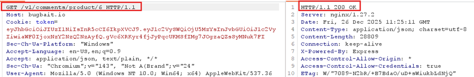

# IDOR – Unauthorized Read via Product ID Manipulation

## Category: 
A01:2025 – Broken Access Control

## Severity
Medium

## Affected Endpoint
GET /v1/comments/product/{id}

## Description
The application does not enforce proper authorization checks
on the comments API. An authenticated user can modify the
product_id parameter and read comments of other products.

## Proof of Concept
1. Login as a normal user
2. Intercept:
   GET /v1/comments/product/3
3. Change product_id to another value
4. Server returns unauthorized data

## Impact
• Data Leakage: Any user can view private or restricted information just by changing a number in the web address.

• Information Scraping: A competitor could easily copy your entire database of customer feedback in minutes using a simple script.

• Privacy Risk: You may be accidentally exposing customer names or emails, which can lead to legal or compliance issues (like GDPR).
 

## Recommendation
• Verify Permissions: Ensure the server asks, "Is this specific user allowed to see this specific product?" before sending any data back.

• Hide Real IDs: Stop using simple numbers (1, 2, 3) and start using long, random "secret codes" (UUIDs) that are impossible for an attacker to guess.

• Centralize Security: Use a single "gatekeeper" function to check permissions across the entire app so no page is left unprotected.

