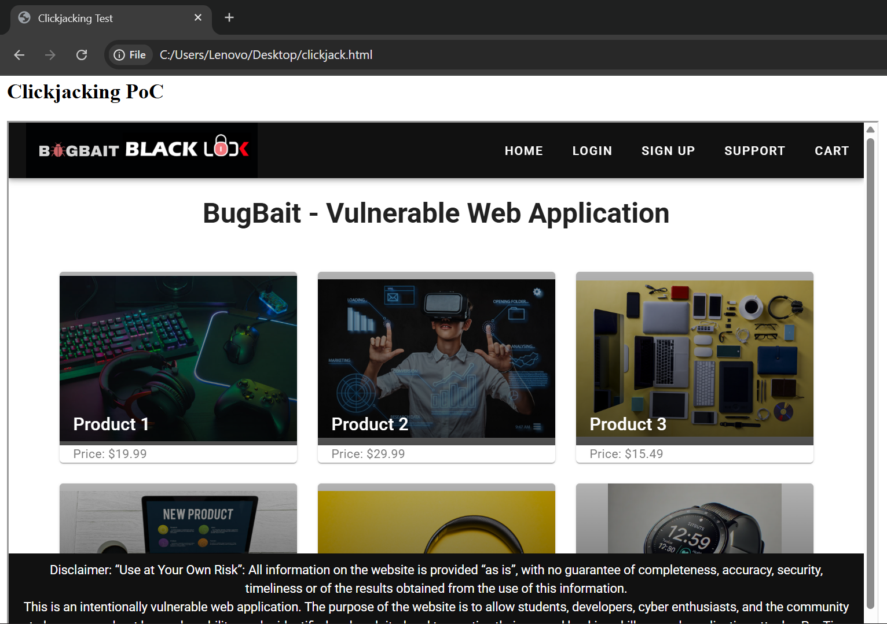
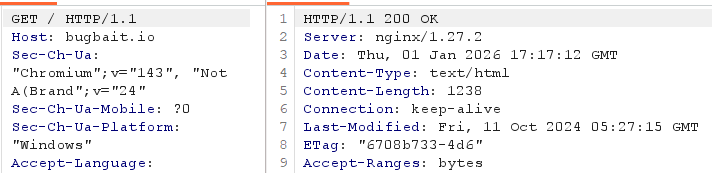

# Clickjacking due to Missing Frame Protection Headers

Category: A02:2025 – Security Misconfiguration  
Severity: High  
Affected Endpoint: /  

## Description

The application does not implement proper frame protection mechanisms to prevent
its pages from being embedded within external websites.

Critical security headers such as **X-Frame-Options** and
**Content-Security-Policy (frame-ancestors)** are missing from HTTP responses.

As a result, the application can be loaded inside an attacker-controlled iframe,
enabling clickjacking attacks where users may unknowingly interact with the
application under a deceptive interface.

## Proof of Concept (PoC)

### Clickjacking via iframe

1. Create an attacker-controlled HTML page containing an iframe.
2. Set the iframe source to the target application URL.
3. Open the attacker HTML file in a browser.
4. Observe that the target application loads successfully inside the iframe.
5. The UI remains fully interactive, confirming the absence of frame protection.

### Missing Security Headers

The HTTP response does not include frame protection headers.

## Impact

- Users can be tricked into performing unintended actions.
- Sensitive clicks and UI interactions can be hijacked.
- Increases risk of account misuse and social engineering attacks.
- Application trust and integrity are compromised.

## Recommendation

- Implement `X-Frame-Options: DENY` or `SAMEORIGIN`.
- Enforce `Content-Security-Policy` with `frame-ancestors`.
- Apply headers consistently across all endpoints.
- Regularly audit response headers for security controls.

