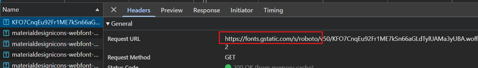

# Software Supply Chain Risk due to Third-Party Dependencies and Dependency Version Exposure

Category: A03:2025 – Software Supply Chain Risks  
Severity: Low  

Affected Components:
- Client-side JavaScript bundles (`/assets/index-*.js`)
- External font resources
- External image hosting services

## Description

The application relies on multiple third-party dependencies as part of its
software supply chain.

During testing, client-side JavaScript bundles were found to expose exact
third-party library versions, and static assets such as fonts and images
were loaded from external domains.

Although no executable third-party JavaScript or compromised build pipeline
was identified, these dependencies introduce indirect supply chain trust risks.
If any trusted third-party service is compromised, the application could be
indirectly affected.

## Proof of Concept (PoC)

1. Open the application in a browser.
2. Open Developer Tools → Network tab.
3. Observe loaded JavaScript bundles (`index-*.js`).
4. Open the bundled JavaScript file in a new tab.
5. Search within the file and observe exposed dependency versions, for example:
   - `@vue/shared v3.5.6`
   - `@vue/reactivity v3.5.6`
6. In the Network tab, filter by **Font** and observe requests to:
https://fonts.gstatic.com/
7. In the Network tab, filter by **Img** and observe image requests to:
https://i.postimg.cc/

## Impact

- Attackers can fingerprint exact client-side dependency versions, enabling
targeted research for known or future vulnerabilities.
- Reliance on external third-party services introduces indirect trust
dependencies.
- Compromise of a trusted third-party service could affect application
integrity or user privacy.

## Recommendation

- Regularly monitor and update third-party dependencies for known vulnerabilities.
- Minimize exposure of dependency version details in client-side bundles
where possible.
- Consider self-hosting static assets such as fonts and images.
- Maintain continuous visibility over third-party services used in the
application’s supply chain.

## Notes

- No external executable JavaScript or CDN-based script execution was identified.
- No dependency confusion or CI/CD pipeline exposure was observed.
- Overall risk is assessed as **Low** due to the absence of direct code
execution vectors.

## Disclaimer

This testing was performed on an intentionally vulnerable application
for educational and learning purposes only.

