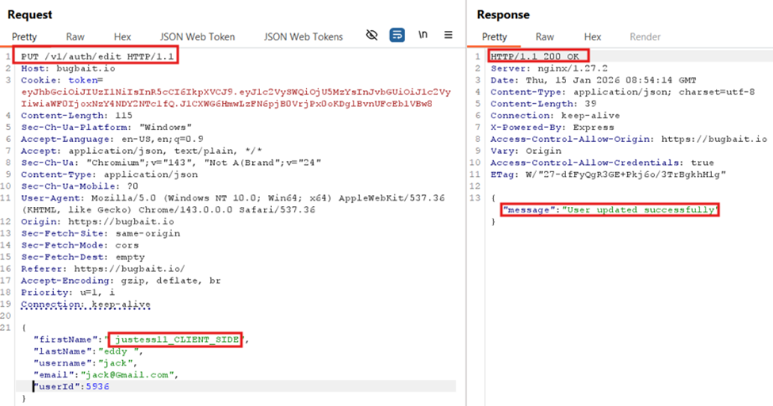

# Excessive Trust in Client-Supplied API Payload

Category: A06:2025 – Insecure Design  
Severity: Medium  
Affected Endpoint: `PUT /v1/auth/edit`

---

## Description

The backend accepts and processes client-supplied JSON payloads without enforcing
strict server-side schema validation.

Modified or missing fields, as well as unexpected parameters, are accepted and
processed successfully. This indicates excessive trust in client-side input and
missing server-side validation controls.

---

## Proof of Concept (PoC)

1. Intercept the profile update request using **Burp Suite**.
2. Send the request to **Repeater**.
3. Modify the JSON payload by:
   - Removing expected fields, or
   - Adding arbitrary fields (e.g., `abuse_test`, random keys).
4. Send the modified request.
5. Observe that the server responds with **HTTP 200 OK** and a success message.

---

## Impact

- Backend behavior can be manipulated outside intended UI logic.
- Enables parameter tampering and business logic abuse.
- Increases attack surface for future privilege or data manipulation.
- Indicates missing server-side input and schema enforcement.

---

## Recommendation

- Enforce strict server-side JSON schema validation.
- Reject unknown or missing mandatory fields.
- Do not rely on client-side controls for security decisions.
- Validate all sensitive parameters on the backend.

---

