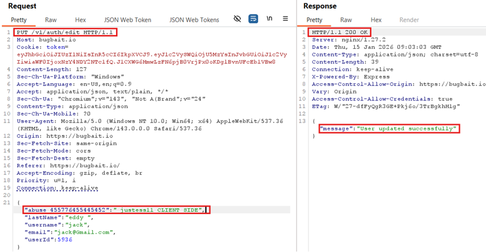

# Lack of Usage Limits Enables Abuse of Legitimate Functionality

Category: A06:2025 – Insecure Design  
Severity: Medium  
Affected Endpoint: `PUT /v1/auth/edit`

---

## Description

The application allows repeated use of the same functionality without any
rate limiting, throttling, or abuse detection mechanisms.

The same endpoint can be invoked multiple times in rapid succession with
slightly modified payloads, and each request is processed successfully.
This indicates missing design-level controls to prevent automated or abusive
use of legitimate functionality.

---

## Proof of Concept (PoC)

1. Send the profile update request to **Burp Repeater**.
2. Modify a field value slightly on each request  
   (e.g., `abuse_1`, `abuse_2`, `abuse_3`).
3. Send the request multiple times rapidly.
4. Observe that every request returns a success response.

---

## Impact

- Enables automation and API abuse.
- Can lead to backend load increase and performance degradation.
- Facilitates spam-like behavior and business logic abuse.
- Dangerous pattern if reused in financial or authentication workflows.

---

## Recommendation

- Implement rate limiting and request throttling.
- Add abuse detection mechanisms for repeated actions.
- Log and monitor excessive API usage.
- Apply stricter controls on sensitive endpoints.

---

