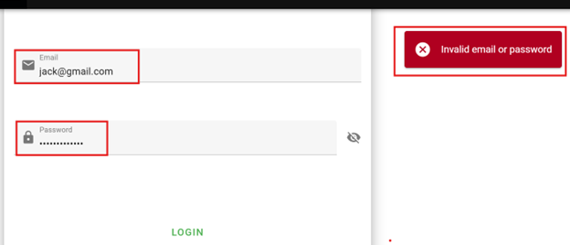

# Missing Rate Limiting on Login Functionality

Category: A06:2025 – Insecure Design  
Severity: Medium  
Affected Endpoint: `POST /v1/auth/login`

---

## Description

The application lacks rate limiting and abuse protection on the login
functionality.

An attacker can submit unlimited authentication attempts with invalid
credentials without triggering any defensive controls such as CAPTCHA,
account lockout, temporary blocking, or request throttling.

This indicates that security controls against brute-force and automated
abuse were not considered during the application design phase.

---

## Proof of Concept (PoC)

1. Navigate to the login page of the application.
2. Enter a valid email address for a user account.
3. Submit an incorrect password multiple times (30+ attempts).
4. Observe that the application consistently returns the same error message:  
   **“Invalid email or password”**
5. No rate limiting, CAPTCHA, cooldown period, or account lockout is enforced.

---

## Impact

- Enables brute-force attacks against user accounts.
- Allows credential stuffing using leaked password lists.
- Increases risk of account takeover.
- Facilitates automated abuse and potential service degradation.

---

## Recommendation

- Implement rate limiting on authentication endpoints.
- Introduce CAPTCHA after multiple failed login attempts.
- Enforce temporary account lockout or cooldown mechanisms.
- Apply monitoring and alerting for abnormal authentication behavior.
- Include abuse prevention and threat modeling during authentication design.

 
